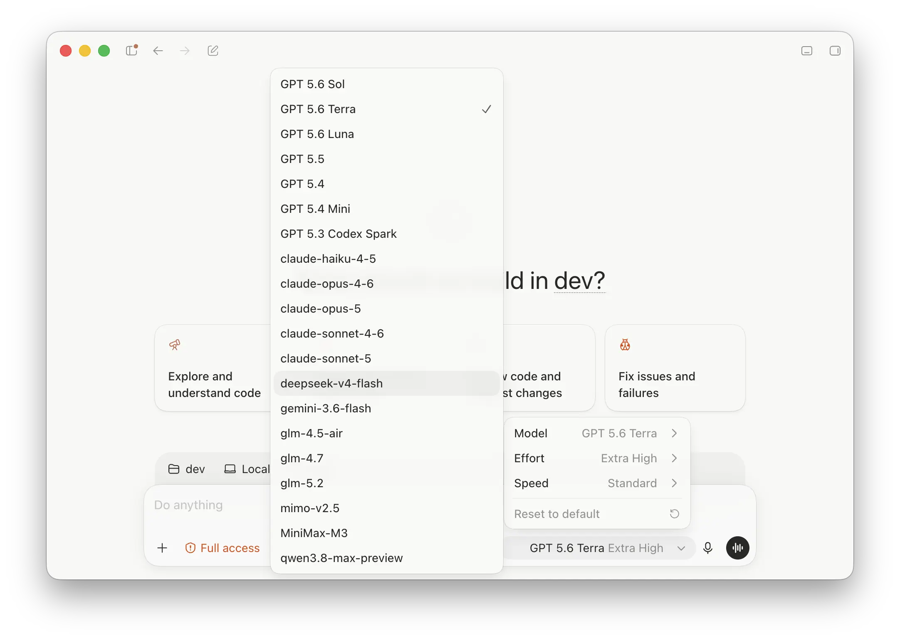

# cpa-codex-compact-bridge

[中文 README](README.zh-CN.md)

A [CLIProxyAPI](https://github.com/router-for-me/CLIProxyAPI) native plugin that keeps Codex remote compaction enabled globally, then chooses the correct compaction path per model: native-capable models pass through unchanged, while unsupported third-party models are bridged through an ordinary summary call.



*One Codex setup can expose official GPT and third-party models side by side; the bridge chooses compaction handling per model.*

## The problem it solves

Codex decides whether to use remote compaction from the configured model provider. Once remote compaction is enabled, compact turns contain protocol-specific requests and state — a `POST /v1/responses/compact` call in V1 or a streaming `compaction_trigger` in V2. Official GPT endpoints understand that protocol; most third-party providers do not, so their compact turns fail with an unsupported request or format error.

This plugin keeps remote compaction available to official GPT models without forcing third-party models to understand it. CLIProxyAPI applies rules to the requested model: native-capable models stay on the original remote-compaction path, while other models receive an ordinary summary request and a bridge-generated response in the shape Codex expects.

## Why not just rename the provider?

The simplest workaround is to change the Codex model provider `name` so Codex no longer treats it as remote-compaction-capable. That forces local compaction and avoids sending remote-compaction items to third-party models, but it applies to the whole provider. Official GPT models routed through the same CLIProxyAPI endpoint also lose provider-native remote compaction and its higher-quality summaries.

The bridge keeps the provider configured for remote compaction and moves the capability decision to per-model rules inside CLIProxyAPI. You keep the best path for both model classes instead of choosing one global compromise.

## Use cases

### Official GPT main agent, third-party sub-agents

Run Codex with an official GPT model as the main agent and third-party models as sub-agents. The official model keeps provider-native remote compaction and its higher-quality summaries. When a third-party sub-agent needs compaction, the plugin converts that turn into an ordinary summary call and returns a Codex-compatible compact result.

### Freely mixing official and third-party models

The main agent and concurrent sub-agents can select official or third-party models at any time. Official models pass through unchanged and keep remote compaction; third-party models are bridged. Both can run in the same Codex setup without changing provider configuration between turns or sending an unsupported compact format upstream.

## How it works

Codex remote compaction has two protocol shapes, plus a replay step. The bridge handles each:

- **V1** — intercepts the non-streaming `POST /v1/responses/compact` endpoint, summarizes the context through an ordinary model request, and returns retained user/developer history plus a marked `compaction` item.
- **V2** — detects a streaming `/v1/responses` request whose final input is a `compaction_trigger`, summarizes through an ordinary model request, and returns the `compaction` SSE item plus `response.completed` that Codex expects.
- **Replay** — on later ordinary turns, converts the plugin's own `cpa_compact_*` plaintext state back into a normal user summary so context survives Responses→Chat conversion.
- **Passthrough** — models you configure as native-compact-capable are forwarded unchanged.

The `encrypted_content` field of a bridged V1 or V2 compaction item holds the **plaintext** summary. It is a compatibility marker (the `cpa_compact_*` ID), not encryption and not a trust, integrity, or confidentiality boundary. See [Security](#security).

## Status

- **Confirmed:** CLIProxyAPI **v7.2.120**, **linux/amd64** — build and integration CI.
- **Compatibility regression tested:** exact CLIProxyAPI **v7.2.125** source in the local real-CPA integration harness; this is not a published linux/amd64 artifact claim.
- **Prebuilt binaries** for linux/amd64 will be published on [GitHub Releases](https://github.com/patrick-fu/cpa-codex-compact-bridge/releases). See [Installation](#installation).
- **Experimental / unverified:** other CLIProxyAPI versions, macOS/Windows builds, and other CPU architectures. Build the library yourself for your platform; behavior is not guaranteed there.

## Disclaimers

- ⚠️ **Not affiliated with OpenAI or CLIProxyAPI.** This is independent community software. It is not endorsed by or certified by OpenAI or CLIProxyAPI's maintainers. "Codex" and "OpenAI" are trademarks of their respective owners.
- The plugin does not vet or authenticate upstream providers. **You are responsible** for ensuring your use of any provider, account, API key, rate limit, and quota complies with the applicable terms of service. This project provides no guarantee of legal, regulatory, or contractual compliance.
- When a model matches a `bridge` rule, the configured summary provider receives a **compressed/summarized version of your conversation context**.
- In V1 and V2 the plaintext summary is placed in `encrypted_content`; it is not encrypted (see above).

## Installation

**Linux amd64 (recommended):** build from source or download a prebuilt binary from [GitHub Releases](https://github.com/patrick-fu/cpa-codex-compact-bridge/releases) when available.

```bash
cd plugin
go build -buildmode=c-shared -o cpa-codex-compact-bridge.so .
```

Place the artifact in CPA's plugin discovery directory:

```text
<plugin-dir>/linux/amd64/cpa-codex-compact-bridge.so
```

**Other platforms (experimental):** use `.dylib` on macOS or `.dll` on Windows and replace the directory with `<GOOS>/<GOARCH>`.

The dynamic library basename (without extension) is the plugin ID. The plugin is compiled against the CLIProxyAPI `v7.2.120` SDK.

## CPA Plugin Store

This plugin is **not yet listed** in the [CPA Plugin Store](https://github.com/router-for-me/CLIProxyAPI-Plugins-Store). You cannot currently install it via CPA's built-in plugin store command. Use the manual installation steps above.

A prebuilt binary release and store submission are planned; see [CONTRIBUTING.md](CONTRIBUTING.md#maintainer-releases) for the maintainer release workflow.

## Configuration

```yaml
plugins:
  enabled: true
  dir: /absolute/path/to/plugins
  configs:
    cpa-codex-compact-bridge:
      enabled: true
      priority: 100
      rules:
        # Third-party models: bridge
        - match: "glm-*"
          action: bridge
          summary_model: "glm-5.2"
        # Native remote-compact models: keep CPA's original path
        - match: "gpt-*-codex*"
          action: passthrough
      on_no_match: passthrough
```

Rules are evaluated in order against the original client-requested model using **case-sensitive** glob matching; the first match wins. `bridge` makes the plugin own that model's compact turns and enables replay normalization; `passthrough` leaves every request on CPA's built-in route. Whether a provider has native compact capability is expressed by you through `bridge` / `passthrough` rules — the plugin does not guess upstream capability.

`summary_model` is optional; when absent, the request model is used for the ordinary summary request. `on_no_match` accepts only `passthrough`.

CLIProxyAPI **Home mode disables plugin executor routing**, so it cannot be used together with a `bridge` rule.

## Security

Read [SECURITY.md](SECURITY.md). In short:

- `encrypted_content` is plaintext, not a security boundary.
- The summary provider receives your compressed context.
- The plugin fails closed (`compact_bridge_failed`) instead of forwarding compaction protocol items to an unsupported upstream.
- Report vulnerabilities privately, not via public issues.

## Verification

```bash
(cd plugin && go test ./... && go vet ./...)
(cd integration && CPA_SOURCE_DIR=/path/to/CLIProxyAPI go test ./... -count=1)
```

The integration suite builds a real CPA binary and the c-shared plugin and covers V1, V2 HTTP/SSE, HTTP replay, streaming replay, and a WebSocket V2 compact turn with `previous_response_id` and its continuation.
It requires a local checkout of CLIProxyAPI at `CPA_SOURCE_DIR`; CI supplies the
pinned checkout automatically.

## Documentation

- [Protocol contract](docs/compact-protocol.md)
- [Configuration](docs/configuration.md)
- [Domain glossary](CONTEXT.md)
- [Architecture decision: plaintext bridged compaction items](docs/adr/0001-use-plaintext-v2-compaction-items.md)

## Contributing

See [CONTRIBUTING.md](CONTRIBUTING.md). Please follow the [Code of Conduct](CODE_OF_CONDUCT.md).

## License

MIT — see [LICENSE](LICENSE). Third-party notices are in [THIRD_PARTY_NOTICES](THIRD_PARTY_NOTICES).
